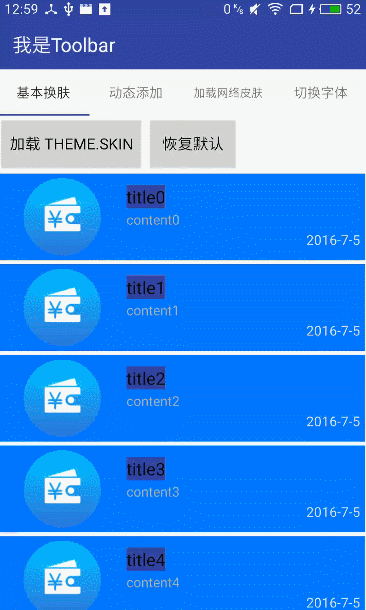

##Android 主题换肤的开源库（插件化换肤）

>本开源库是基于我之前的一个博客 [Android主题换肤 无缝切换](http://www.jianshu.com/p/af7c0585dd5b) 不知道原理的可以去这篇博客看看。

>出于易于集成的目的，我将其抽取出来，作为一个模块。提供简洁的api，方便使用。

>目前暂时没有发现兼容性问题，欢迎提供使用反馈。


>###更新日志：
>- v1.3.1:优化换字体部分代码
>
>- v1.3.0:增加一键切换字体(初版)
>
>- v1.2.1:完善之前版本View的创建
>
>- v1.2.0:增加对换肤属性自定义扩展
>
>- v1.1.0:可以直接加载网络上的皮肤文件

效果图如下：



###1. 集成步骤：

1. 添加依赖<code>  compile 'com.solid.skin:skinlibrary:1.3.1'</code>

2. 让你的Application继承于SkinBaseApplication

3. 让你的Activity继承于SkinBaseActivity，如果使用了Fragment则继承于SkinBaseFragment

4. 在需要换肤的根布局上添加 <code>xmlns:skin="http://schemas.android.com/android/skin" </code>，然后在需要换肤的View上加上 <code>skin:enable="true"</code>

5. 新建一个项目模块（只包含有资源文件），其中包含的资源文件的name一定要和原项目中有换肤需求的View所使用的资源name一致。

6. 打包皮肤文件，放入assets中的skin目录下（skin目录是自己新建的）

7. 调用换肤

 - 在<code>assets/skin</code>文件夹中的皮肤
 
```html
  SkinManager.getInstance().loadSkin("Your skin file name in assets(eg:theme.skin)",
                                new ILoaderListener() {
                                    @Override
                                    public void onStart() {
                                        Toast.makeText(getApplicationContext(), "正在切换中", Toast.LENGTH_SHORT).show();
                                    }

                                    @Override
                                    public void onSuccess() {
                                        Toast.makeText(getApplicationContext(), "切换成功", Toast.LENGTH_SHORT).show();
                                    }

                                    @Override
                                    public void onFailed() {
                                        Toast.makeText(getApplicationContext(), "切换失败", Toast.LENGTH_SHORT).show();
                                    }
                                }

                        );
```

 - 皮肤来源于网络

```html
SkinManager.getInstance().loadSkinFromUrl(skinUrl, new ILoaderListener() {
                    @Override
                    public void onStart() {
                        Log.i("ILoaderListener", "正在切换中");
                        dialog.setContent("正在从网络下载皮肤文件");
                        dialog.show();
                    }

                    @Override
                    public void onSuccess() {
                        Log.i("ILoaderListener", "切换成功");
                        dialog.dismiss();
                    }

                    @Override
                    public void onFailed(String errMsg) {
                        Log.i("ILoaderListener", "切换失败:" + errMsg);
                        dialog.setContent("换肤失败:" + errMsg);
                    }

                    @Override
                    public void onProgress(int progress) {
                        Log.i("ILoaderListener", "皮肤文件下载中:" + progress);
                        dialog.setProgress(progress);
                    }
                });
```
详细的使用，请到示例项目中查看


###2.换肤属性的扩展

本开源库默认支持textColor和background的换肤。如果你还需要对其他属性进行换肤，那么就需要去自定义了。

那么如何自定义呢？看下面这个例子：

TabLayout大家应该都用过吧。它下面会有一个指示器，当我们换肤的时候也希望这个指示器的颜色也跟着更改。

- 新建一个TabLayoutIndicatorAttr 继承于 SkinAttr，然后重写apply方法。apply方法在换肤的时候就会被调用

- 代码的详细实现 
```html
public class TabLayoutIndicatorAttr extends SkinAttr {
    @Override
    public void apply(View view) {
        if (view instanceof TabLayout) {
            TabLayout tl = (TabLayout) view;
            if (RES_TYPE_NAME_COLOR.equals(attrValueTypeName)) {
                int color = SkinResourcesUtils.getColor(attrValueRefId);
                tl.setSelectedTabIndicatorColor(color);
            }
        }
    }
}
```

注：attrValueRefId：就是资源id。SkinResourcesUtils是用来获取皮肤包里的资源，这里设置color或者drawable一定要使用本工具类。

- 当上面的工作完成之后，就到我们自己的Application的onCreate方法中加入<code> SkinConfig.addSupportAttr("tabLayoutIndicator", new TabLayoutIndicatorAttr());</code>

- 最后我们就可以正常使用了，<code>dynamicAddSkinEnableView(tablayout, "tabLayoutIndicator", R.color.colorPrimaryDark);</code>

###3. 关于字体切换

还是遵守本项目的约定大于配置的原则，所有的字体都放到assets/fonts文件夹下

如何切换字体:
<code> SkinManager.getInstance().loadFont("xx.ttf")</code>

关于切换字体需要配置的东西：
如果只是单纯的想要字体切换这个功能。只需<code>集成步骤</code>中的前三步就行了。

###4. 其他一些重要的api
        
1. SkinConfig.isDefaultSkin(context):判断当前皮肤是否是默认皮肤

2. SkinManager.getInstance().restoreDefaultTheme(): 重置默认皮肤

3. dynamicAddView：当动态创建的View也需要换肤的时候,就可以调用dynamicAddView


---
###5. 使用注意事项：
1. 换肤默认只支持android的常用控件，对于支持库的控件和自定义控件的换肤需要动态添加（例如： <code>dynamicAddSkinEnableView(toolbar, "background", R.color.colorPrimaryDark);</code>），在布局文件中使用<code>skin:enable="true"</code>是无效的。

2. 默认不支持状态栏颜色的更改，如果需要换肤的同时也要更改状态栏颜色，请到您的Application文件中加入<code>SkinConfig.setCanChangeStatusColor(true);</code>，状态栏的颜色值来源于<code>colorPrimaryDark</code>

3. 本开源库使用的Activity是AppCompatActivity，使用的Fragment是android.support.v4.app.Fragment

4. 有换肤需求View所使用的资源一定要是引用值，例如：@color/red，而不是#ff0000


##致谢：

本项目是基于Android-Skin-Loader这个开源库改进而来，再次对原作者表示感谢
[Android-Skin-Loader](https://github.com/fengjundev/Android-Skin-Loader)


LICENSE

```html
Copyright [2016] [_SOLID]

Licensed under the Apache License, Version 2.0 (the "License");
you may not use this file except in compliance with the License.
You may obtain a copy of the License at

   http://www.apache.org/licenses/LICENSE-2.0

Unless required by applicable law or agreed to in writing, software
distributed under the License is distributed on an "AS IS" BASIS,
WITHOUT WARRANTIES OR CONDITIONS OF ANY KIND, either express or implied.
See the License for the specific language governing permissions and
limitations under the License.

```
